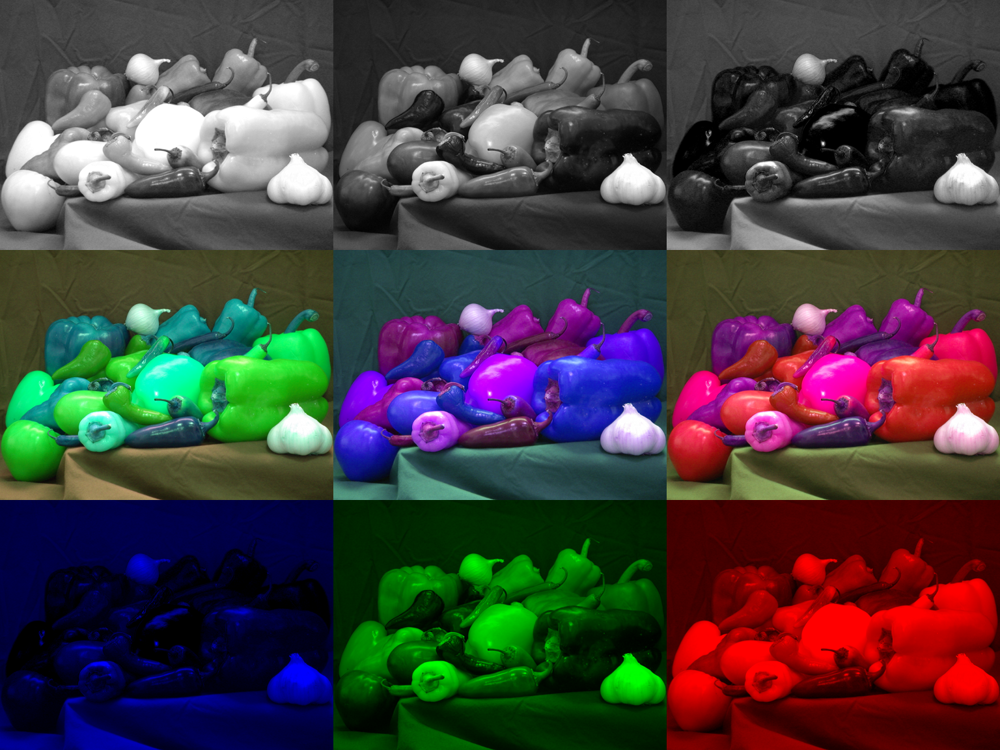
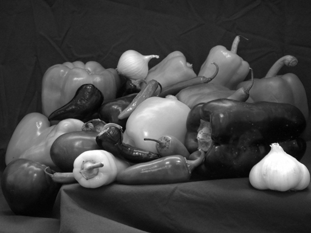
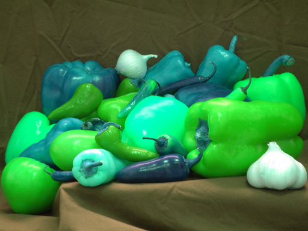
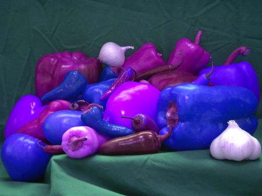
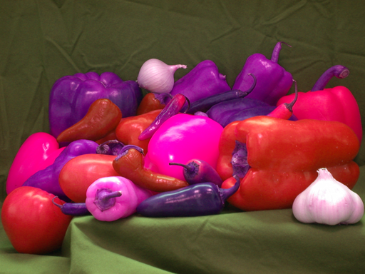
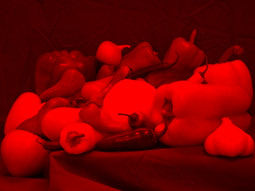
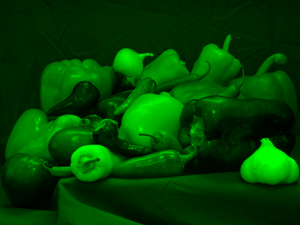
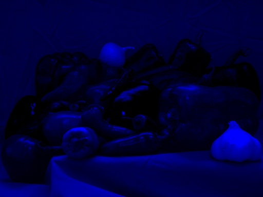

# 🖼 Görüntü İşlemenin Temelleri - EEEN 439

Bu repository, Pamukkale Üniversitesi EEEN 439 Görüntü İşlemenin Temelleri dersinin ilk ödevinin çözümünü içermektedir.

<h3>🎨 İçindekiler</h3>

**[Hafta 01](assignment-01):** Python, OpenCV kullanarak peppers.png üzerinde renk filtrelerinin uygulanması.

## Demo Görseli

## Grayscale Görüntüler

| Red Channel | Green Channel | Blue Channel |
|-------------|---------------|--------------|
|  |  |  |

## Değiştirilmiş Yapay Renkli Görüntüler

| GRB | RBG | GBR |
|-----|-----|-----|
|  |  |  |

## Renk Filtreleri Uygulanmış Görüntüler

| Red Filter | Green Filter | Blue Filter |
|------------|--------------|-------------|
|  |  |  |

## Lisans

Bu proje MIT Lisansı ile lisanslanmıştır. Detaylar için [LICENSE](LICENSE)
