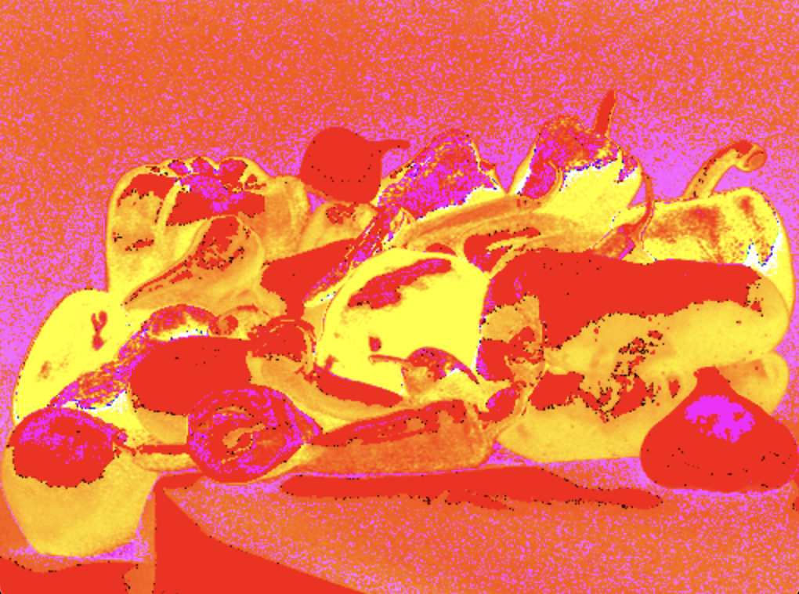

# Hafta 02

Python ve OpenCV kullanarak peppers.png üzerinde HSI filtresinin uygulanması.

**[Ana Sayfa](..)**

## HSI Filtresi Uygulanmış Görsel

## Lisans

Bu proje MIT Lisansı ile lisanslanmıştır. Detaylar için [LICENSE](LICENSE)
