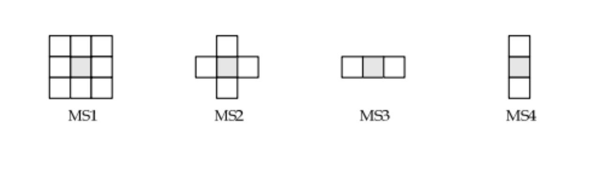

# Hafta 06

Bu kod, bir görüntüye Gauss gürültüsü eklemeyi ve ardından gürültüyü azaltmak için 3x3 medyan filtreleme uygulamayı simüle eder. Kodun adım adım ne yaptığına dair açıklama:

1. Gauss Gürültüsü Ekleme:

add_noise adında bir fonksiyon tanımlar. Bu fonksiyon bir görüntü ve gürültü yoğunluğunu kontrol eden bir varyans değeri (varsayılan olarak 0.05) alır.
np.random.normal kullanarak belirtilen varyansa sahip Gauss gürültüsü üretir.
Gürültü değerleri np.clip kullanılarak geçerli gri tonlama aralığına (0-255) klipslenir.
Gürültü orijinal görüntüye eklenir ve sonuç görüntü verileri için uygun bir 8 bitlik tamsayısal (uint8) formatına dönüştürülür.

2. Medyan Filtreleme:

Orijinal gri tonlama görüntüyü (img_ori) okur.
Gürültülü ve filtrelenmiş görüntüleri depolamak için bir output dizini oluşturur.
add_noise fonksiyonu kullanılarak gürültülü görüntü oluşturulur.
3x3 çekirdek boyutuna (kernel_size = 3) sahip bir medyan filtresi cv2.medianBlur kullanılarak gürültülü görüntüye uygulanır. Bu, tuz ve biber gürültüsünü ve diğer ani gürültü türlerini ortadan kaldırmaya yardımcı olur.

**[Ana Sayfa](..)**

## Tuz biber gürültüsü eklenmiş ve Medyan Filtreleme uygulanmış çıktılar

| Salt and Pepper Noise            | Median Filtering (MS2)                 |
| -------------------------------- | -------------------------------------- |
|  |  |

## Farklı Medyan Filtreleme için farklı pencere boyutları

## Lisans

Bu proje MIT Lisansı ile lisanslanmıştır. Detaylar için [LICENSE](LICENSE)
